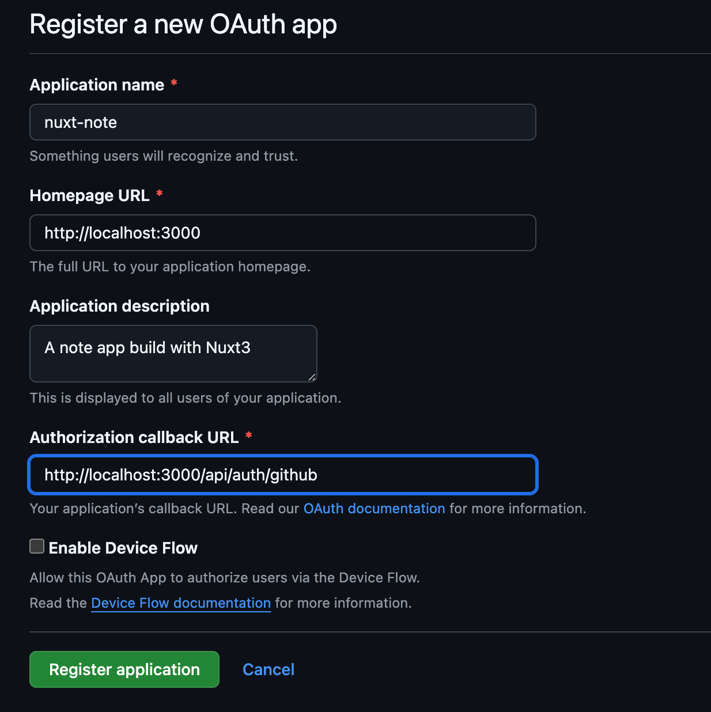
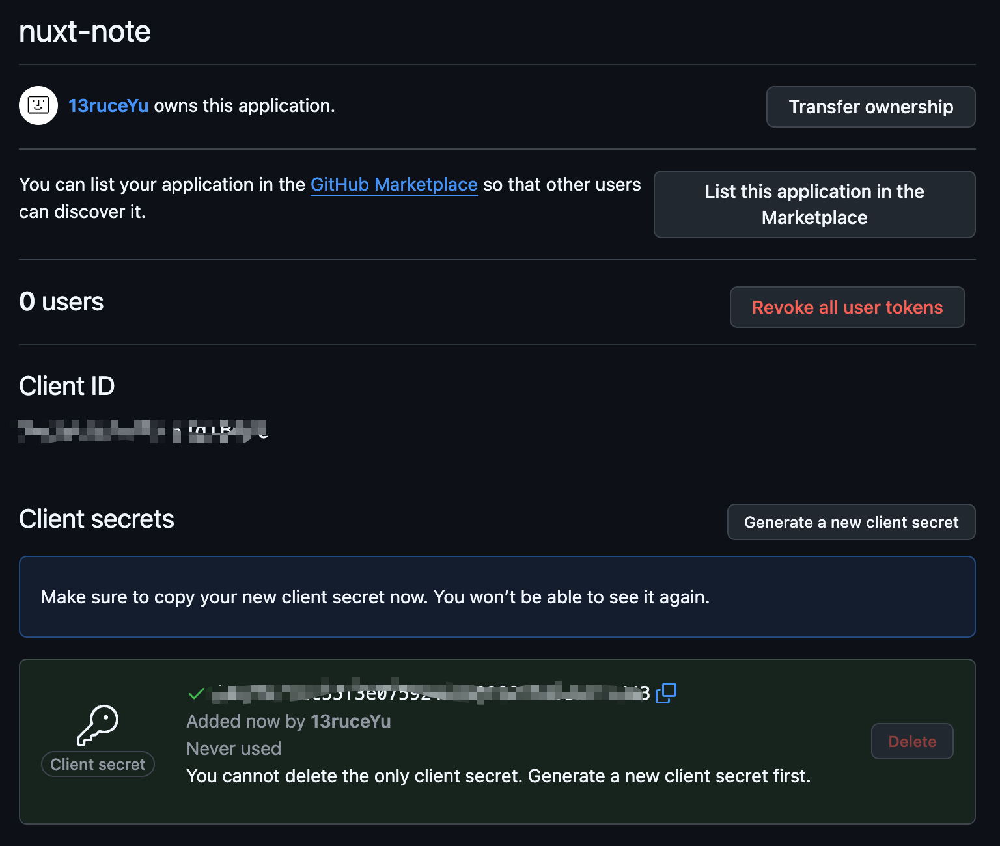

OAuth（Open Authorization）是一种开放标准，它可以让用户不暴露自己密码的情况下，让第三方应用获取访问用户资源的权限。

对开发者来说，在 oauth 工作流中，主体有两个，一个是开发者的应用，另一个是授权提供者（Authorization Providers），常见的有 Google，Github。下面我们会以 GitHub 为例子，来完成 oauth 工作流。

OAuth 的流程可以分为以下几个步骤：

1. 授权请求：用户在第三方应用发起授权请求，第三方应用将用户重定向到 GitHub 的授权页面。
2. 用户同意授权：用户同意授权后，Github 会生成一个授权码（code）并发送给第三方应用。
3. 获取访问令牌：第三方使用授权码（code）向 GitHub 申请访问令牌（token）。
4. 使用令牌访问资源：第三方使用令牌（token）访问用户在 GitHub 上的资源。

简单来说就是用 code 换 token，拿 token 取用户信息。下面我们以 GitHub 为例，看看具体的过程。

首先我们需要在 GitHub 上创建一个 OAuth 应用，来获取 `Client ID` 和 `Client Secret` 生成跳转链接：

<https://github.com/settings/applications/new>



注册成功之后，我们就可以拿到 `Client ID` 和 `Client Secret`。



当拿到这两个数据之后，我们就可以补全 GitHub 的授权页面跳转链接：

`https://github.com/login/oauth/authorize?client_id=YOUR_CLIENT_ID&redirect_uri=YOUR_REDIRECT_URI&scope=YOUR_SCOPES`

* client_id：就是上面的 Client ID
* redirect_uri：需要和之前创建时的 callback URL 一致
* scope：请求的权限范围，常见的有 read:user, user:email

我的跳转链接大概长这样：

`https://github.com/login/oauth/authorize?client_id=YOUR_CLIENT_ID&redirect_uri=http://localhost:3000/api/auth/github&scope=read:user,user:email`

当用户点击链接到 GitHub 的授权页面之后，在用户点击同意或允许之后，Github 就会重定向到 redirect_uri，并且携带上授权码：

`http://localhost:3000/api/auth/github?code=AUTHORIZATION_CODE`

当你的接口获取到授权码之后就可以来请求 GitHub 的令牌：

`https://github.com/login/oauth/access_token`

请求应该包含以下参数：

* client_id: 你在 GitHub 上创建应用时获取的 Client ID。
* client_secret: 你在 GitHub 上创建应用时获取的 Client Secret。
* code: 从回调 URL 中获得的授权码。
* redirect_uri: 与授权请求中相同的回调 URL。

如果请求成功，我们就可以拿到令牌：

```json
{
  "access_token": "ACCESS_TOKEN",
  "scope": "read:user,user:email",
  "token_type": "bearer"
}
```

通过这个令牌，我们也就可以通过 GitHub 的 API 获取到用户的相关信息存入到我们的数据库中。

```ts
const githubUser = await $fetch<{
  email: string;
  id: number;
  name: string;
  login: string; // GitHub username as fallback
}>('https://api.github.com/user', {
  headers: {
    Authorization: `Bearer ${tokenResponse.access_token}`
  }
})
```

## 总结

GitHub OAuth 的过程可以概括为：

1. 通过跳转链接获取 code。
2. 通过 code 获取 access_token。
3. 最后使用 access_token 请求 GitHub 的接口获取相关用户数据。

参考代码：<https://github.com/13ruceYu/oauth-nuxt>
